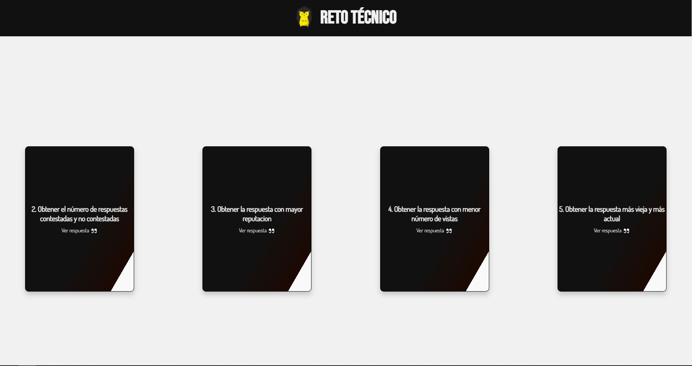

# [XalDigital](https://jesusj1menez.github.io/xaldigital/ 'Lego')

     

Pagina con diseño libre, resultado de las preguntas al hacer hover en las cards y tambien desde la consola.

Para ejecutar las consultas del archivo app.js se necesita crear la base de datos e insertar las tuplas que viene en el script de vuelos(creacion, inserts y consultas).sql, verificar que la informacion(host, user, password y database) de la conexion a la base de datos sea la correcta, instalar los paquetes de desarrollo (nodemon) y produccion(mysql) con el comando`npm install` y utilizar el comando `npm run nodemon` para corrrer el archivo.

Nota: En el punto 3. Obtener la respuesta con mayor owners, daniel correa me comento que la cambiara por 3. Obtener la respuesta con mayor reputacion

